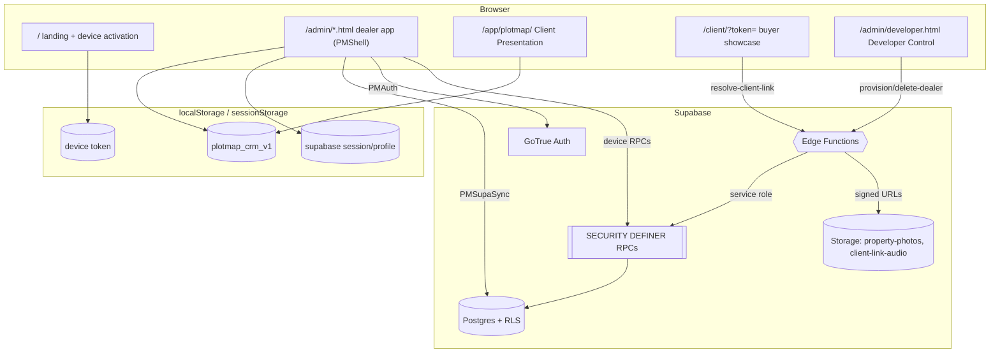

# 01 · Product and System Overview

## What PlotMap is

**PlotMap is a multi-tenant SaaS for real-estate plot dealers** (initial market: the
Tricity region — Chandigarh / Mohali / Panchkula / New Chandigarh / Zirakpur). A dealer
runs their whole plot business inside it: a **local-first CRM** (properties, customers,
deals, demand, follow-ups), an **interactive map engine** for showing masterplans and
sector maps to walk-in customers on screen, and a **Private Client Link** system for
sending a frozen, client-safe property showcase to a buyer's phone. The platform operator
("Developer Control" / platform admin) onboards dealers, issues device activation codes,
and can permanently delete a dealer. `APPROVED-PRODUCT` (Master Context Report) +
`VERIFIED-CODE` (routes, adapters, maps below).

## The three product surfaces

| Surface | Route root | Audience | Auth model |
|---|---|---|---|
| **Dealer application** (CRM + admin shell) | `/admin/*.html` | Dealer owner + team members | Supabase email/password session, gated by approved device |
| **Client Presentation** (full-screen map) | `/app/plotmap/` | Dealer showing a customer, in person | Same session; viewer role also allowed here |
| **Private Client Link** (mobile showcase) | `/client/?token=…` | The buyer, on their own phone | **No login** — opaque 256-bit bearer token only |
| **Landing / device activation** | `/` (`index.html`) | Anyone; entry point | Anonymous; activation-code gate |
| **Developer Control** | `/admin/developer.html` | Platform admin only | Supabase session + `plotmap_is_platform_admin` |

## Core value propositions (product intent)

1. **Works on a locked, approved device.** A dealer's browser must be activated with a
   code before protected routes open. Access is device-bound, not just password-bound, so
   a leaked password alone grants nothing. `VERIFIED-CODE` `admin/core/device-access.js`.
2. **Local-first, sync-later CRM.** All CRM data lives in `localStorage`
   (`plotmap_crm_v1`) and syncs to Supabase in the background, so the app stays fast and
   usable offline within a grace window. `VERIFIED-CODE` `admin/core/data-adapter.js`,
   `admin/core/sync-queue.js`, `admin/core/supabase-sync.js`.
3. **On-screen map selling.** 170 registered maps (masterplans + sector/block maps), each
   with an "Original Map" (raw scan) and an "Easy Map" (cleaned render), overlays, pins,
   and property placement. `VERIFIED-CODE` `app/plotmap/map-registry.js` (170 entries).
4. **Client-safe sharing.** A Private Client Link freezes a *snapshot* of selected plots
   at creation time — never live inventory — hiding seller identity, commission, internal
   notes, and (optionally) price/exact location. Server-signed media, expiry, revocation,
   and engagement tracking are built in. `VERIFIED-SQL`
   `supabase/migrations/20260728000100_private_client_links.sql`.

## Tenancy and isolation

Every dealer is a **tenant** identified by a text `dealer_id` (a lowercase slug, e.g.
`dealer-demo`). Isolation is enforced in **two independent layers**:

- **Client layer (honesty only):** the data adapter tags and filters records by
  `dealerId`; the UI hides nav/actions the role can't use. `VERIFIED-CODE`
  `admin/core/data-adapter.js:97-110`, `admin/core/access-control.js`.
- **Server layer (real security):** Supabase **Row-Level Security** scopes every table to
  `plotmap_current_dealer_id()`, and privileged actions run only through
  `SECURITY DEFINER` RPCs. This is the boundary that actually protects tenant data.
  `VERIFIED-SQL` (see `15_SUPABASE_RLS_RPCS_AND_GRANTS.md`).

## Roles

`VERIFIED-CODE` `admin/core/access-control.js:38-58`, `admin/core/auth.js:50-71`.

| Role (profile.role) | Normalized | Admin landing | Scope highlights |
|---|---|---|---|
| `owner` (aka `dealer`) | owner | `/admin/owner.html` | All scopes; only role for owner-only routes |
| `manager` | team | `/admin/team.html` | Everything except billing/dealer-settings/... (see `03`) |
| `team` (legacy generic) | team | `/admin/team.html` | Properties, map studio, clients, deals, exports, audit |
| `map_editor` | team | `/admin/team.html` | Presentation + map studio only |
| `property_editor` | team | `/admin/team.html` | Presentation + properties only |
| `viewer` | viewer | `/app/plotmap/` | Client Presentation only |
| Platform admin | (separate) | `/admin/developer.html` | Cross-tenant onboarding + deletion via RPC |

## Technology (as-built)

- **Frontend:** hand-authored **vanilla HTML/CSS/JS**, one `<script>`-per-module,
  globals on `window` (`PMAuth`, `PMDeviceAccess`, `PMDataAdapter`, `PMFoundation`,
  `PMShell`, `PMClientLinks`, `PMSupaSync`, `PM_MAP_REGISTRY`, `PMRuntimeConfig`).
  No bundler, no framework, no npm runtime deps. `VERIFIED-CODE`.
- **Design system:** "violet-dusk" — `admin/core/plotmap-ds.css` (dealer shell) and
  `app/plotmap/styles/violet-dusk-foundation.css` (presentation). A legacy
  `admin/crm-ui.css` still exists and is the design system V2 must **not** carry forward.
- **Backend:** Supabase (Postgres + Auth/GoTrue + Storage + Edge Functions/Deno).
- **Build/deploy:** `tools/build-dist.js` produces an allowlisted static `dist/`; Vercel
  serves it (project reported as `property-software`). `VERIFIED-CODE` `vercel.json`,
  `tools/build-dist.js`; project name is `REPORT-CLAIM`.

## System map (Mermaid)

See `02_ARCHITECTURE_AND_INITIALIZATION.md` for boot order and the global object graph.
