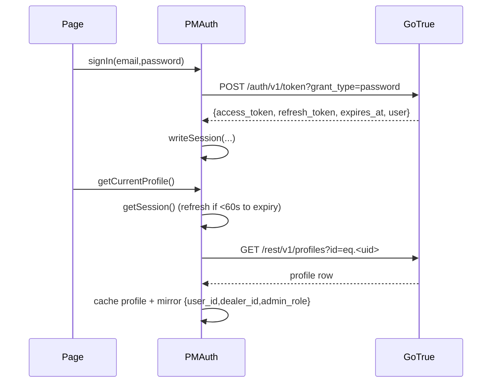

# 05 · Auth and Session (code-level)

Source: `admin/core/auth.js` (294 lines) — global `PMAuth`. All `VERIFIED-CODE`.
Reusable extract: `migration-kit/auth/auth.js` + `migration-kit/auth/MANIFEST.md`.

## Design summary

PlotMap auth talks to Supabase **GoTrue REST directly** (no Supabase JS SDK on admin
pages). It stores the session and profile in `localStorage`, mirrors a small "legacy role"
triple for the data adapter, refreshes tokens lazily, and in local dev auto-mocks a session
so pages open without login.

## Storage keys (contract — preserve semantics in V2)

| Key | Written by | Holds |
|---|---|---|
| `plotmap_supabase_session_v1` | `writeSession` | `{ access_token, refresh_token, expires_at, user }` |
| `plotmap_supabase_profile_v1` | `writeJson(PROFILE_KEY,…)` | profile row `{ id,email,role,dealer_id,status,permissions?,display_name? }` |
| `plotmap_user_id` | `applyLegacyRole`/`fetchProfile` | profile id (adapter/user resolution) |
| `plotmap_dealer_id` | same | tenant id (adapter scoping, device gate, sync) |
| `plotmap_admin_role` | same | `dealer` \| `team` \| `viewer` (coarse UI role) |

`clearSession()` removes session+profile+the legacy triple. `clearLegacyRoleState()` clears
just the triple. `VERIFIED-CODE` `auth.js:40-85`.

## Public API (`window.PMAuth`)

| Symbol | Inputs | Output / effect | Notes |
|---|---|---|---|
| `SUPABASE_URL`, `SUPABASE_KEY` | — | resolved public config | from `PMRuntimeConfig` |
| `isLocalDev()` | — | bool | localhost/127.0.0.1/::1/*.local |
| `isAdminRoute()` | — | bool | `^/admin/` |
| `normalizeRole(role)` | role | canonical role | `dealer→owner`, `staff→team` |
| `routeForRole(role)` | role | landing path | owner/team/viewer routing |
| `readSession()` | — | session or null | sync read |
| `getSession()` | — | Promise<session\|null> | **refreshes if within 60s of expiry**; clears on refresh failure |
| `getUser(session?)` | — | Promise<user\|null> | GET `/auth/v1/user` |
| `getCurrentProfile()` | — | Promise<profile\|null> | cached-if-fresh else `fetchProfile` |
| `fetchProfile(session?)` | — | Promise<profile\|null> | selects `id,email,role,dealer_id,status[,permissions,display_name]`; **falls back to base column set pre-migration** |
| `getAccessToken()` | — | Promise<token\|null> | for RPC bearer |
| `signIn(email,password)` | creds | Promise<session> | POST `/auth/v1/token?grant_type=password` |
| `signOut()` | — | Promise | GoTrue logout + `clearSession` |
| `requireProfile(requiredRole?)` | role | `{ok,reason,profile}` | reasons: `missing_session`, `inactive_profile`, `role_not_allowed` |
| `buildLoginRedirect(next?,reason?)` | — | `/` + query | **same-origin only** (open-redirect safe) |
| `applyLegacyRole(profile)` | profile | writes legacy triple | mirror for adapter |

## Session lifecycle

## Critical behaviours to preserve (V2)

1. **Lazy refresh with skew.** `getSession` refreshes when `expires_at - now ≤ 60s`
   (`REFRESH_SKEW_MS`). A failed refresh **clears the session** and returns null — the app
   then re-gates. `VERIFIED-CODE` `auth.js:141-153`.
2. **Profile column fallback.** `fetchProfile` first requests `permissions,display_name`
   then retries with the base set if the columns don't exist — login survives a partially
   migrated DB. Preserve this tolerance or guarantee columns exist. `auth.js:169-194`.
3. **Legacy role mirror is a coupling.** The data adapter, device gate, sync, and event
   tracker all read `plotmap_dealer_id`/`plotmap_user_id`/`plotmap_admin_role` from
   localStorage, written here. If V2 changes the auth store, it **must** keep an equivalent
   authoritative `dealer_id` mirror or refactor every consumer. `INFERENCE` — cross-file
   dependency, see `08`.
4. **Open-redirect safety.** `buildLoginRedirect` always targets `/` with the destination
   as a query param; it never redirects to an attacker-controlled absolute URL. The report
   references an "open-redirect fix" — this same-origin construction is it. Preserve.
   `VERIFIED-CODE` `auth.js:238-244`; `HISTORICAL` (report's Phase-1 fix note).
5. **Local-dev auto-mock.** On localhost, if no session exists, a mock owner session +
   profile is written so pages open without login. V2 must gate this behind an explicit
   dev flag so it can never activate in production. `VERIFIED-CODE` `auth.js:258-268`.

## Failure modes

| Situation | Behaviour |
|---|---|
| No/invalid session | `getSession`→null; guard renders login redirect |
| Refresh token rejected | `clearSession`, treated as logged out |
| Profile `status !== 'active'` | `requireProfile`→`inactive_profile` (page blocks) |
| Role below requirement | `requireProfile`→`role_not_allowed` |
| DB missing new columns | base-column fallback keeps login working |

## Platform-admin check (not in auth.js)

Developer Control proves platform-admin **server-side** via
`fetch(SUPABASE_URL + '/rest/v1/rpc/plotmap_is_platform_admin', {Bearer token})` and
requires the boolean `true`. Never a localStorage flag. `VERIFIED-CODE`
`admin/core/access-control.js:311`, `admin/developer.html`.

## V2 decision
**ADAPT.** Keep the exact contract (REST GoTrue, the storage keys, the refresh-skew, the
column fallback, the open-redirect-safe redirect, the server-only platform-admin check),
but re-house it as a single typed `auth` module with an explicit `dealerId` accessor other
modules import instead of reading localStorage directly.
