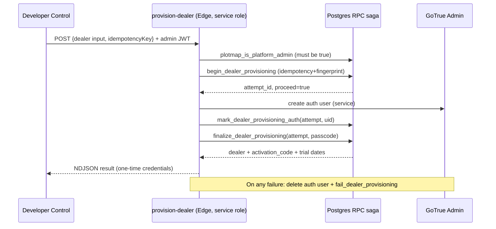

# 07 · Developer Control and Dealer Onboarding

Sources: `admin/developer.html`, `supabase/functions/provision-dealer/index.ts` (566 lines),
`supabase/functions/delete-dealer/index.ts` (258 lines), and the provisioning migration
`supabase/migrations/20260722_one_click_dealer_provisioning.sql`. All `VERIFIED-CODE` /
`VERIFIED-SQL`. Deletion detail is in `18`.

## What Developer Control is

`/admin/developer.html` is the **platform-operator** console. It is gated by a Supabase
session **and** a server-side `plotmap_is_platform_admin` check (never a client flag). From
it the operator: creates (provisions) a dealer end-to-end, generates dealer activation
codes, manages devices, and permanently deletes a dealer. `VERIFIED-CODE`
`access-control.js:311`, `admin/developer.html:1651` (`plotmap_admin_create_dealer_activation_code`).

## One-click provisioning — the security model

The `provision-dealer` Edge Function is **the only layer allowed to use the
service-role key** and it never logs bodies, credentials, tokens, or activation codes. Its
job is a **transactional, idempotent, streaming** onboarding: it validates the caller is a
platform admin, validates+normalizes input, then walks a multi-stage RPC saga in Postgres,
creating the GoTrue Auth user in between, and rolls the Auth user back on failure.
`VERIFIED-CODE` `provision-dealer/index.ts:1-13, 282-337`.

### Input contract (validated in `normalizeInput`)
`dealerId` (`^[a-z0-9](?:[a-z0-9-]{1,38}[a-z0-9])$`), `businessName` (2–160),
`ownerName` (2–120), optional `ownerPhone`, `primaryArea` (2–120), `loginEmail`,
`accountStatus` (**must be `active`**), `subscriptionStatus` (`trial|active`),
trial dates (required + future when trial), `deviceLimit` (1–20),
`activationExpiresAt` (10 min–30 days out), `passcode` (8–72 bytes),
`idempotencyKey` (16–128, `^[A-Za-z0-9._:-]+$`). All XSS-unsafe text rejected.
`VERIFIED-CODE` `provision-dealer/index.ts:122-210`.

### The provisioning saga (RPC chain)

| Stage | RPC (as signed-in admin unless noted) | Purpose |
|---|---|---|
| begin | `plotmap_admin_begin_dealer_provisioning` | idempotency + fingerprint gate; returns `attempt_id`, `proceed`/`completed` |
| — | `plotmap_service_auth_user_by_email` (service) | check for existing Auth user by email |
| create login | GoTrue `POST /auth/v1/admin/users` (service) | create Auth user with `app_metadata` binding |
| link owner | `plotmap_admin_mark_dealer_provisioning_auth` | bind auth user id to attempt |
| finalize | `plotmap_admin_finalize_dealer_provisioning` | write dealer+profile+passcode+activation code (transactional) |
| fail/rollback | `plotmap_admin_fail_dealer_provisioning` | record failure; delete Auth user if created this call |
| status probe | `plotmap_admin_get_dealer_provisioning_attempt` | reconcile on error |
| gate | `plotmap_is_platform_admin` | platform-admin check |

The response is **NDJSON stream** of `{type:'stage'|'result'|'error'}` events. The final
`result` returns one-time credentials (passcode echoed from input, generated
`activationCode`, `codeExpiresAt`, `deviceLimit`, trial dates). If the DB says already
completed, credentials are **not** re-shown (`COMPLETED_CREDENTIALS_UNAVAILABLE`).
`VERIFIED-CODE` `provision-dealer/index.ts:346-502`.

### Idempotency & fingerprint
`idempotencyKey` + a SHA-256 `request_fingerprint` over the normalized input make retries
safe: a retry with a different fingerprint is rejected (`IDEMPOTENCY_CONFLICT`); an
in-flight attempt returns `PROVISIONING_IN_PROGRESS` (409); a completed attempt returns the
"credentials unavailable" path. `VERIFIED-CODE` `provision-dealer/index.ts:544-557, 382-397`.

### Rollback / compensation
On error after creating the Auth user this call, the function deletes the Auth user and
marks the attempt failed with `recoverable` set appropriately; if Auth deletion fails it
reports `AUTH_ROLLBACK_FAILED` and retains the user for manual reconcile. The DB attempt
record is the durable source of truth. `VERIFIED-CODE` `provision-dealer/index.ts:452-491`.

## Onboarding sequence (Mermaid)

## Activation-code creation
Developer Control also generates activation codes independently via
`plotmap_admin_create_dealer_activation_code` (bound to a dealer, with expiry). The dealer
then enters the code on the landing/device screen to activate a browser (`06`).
`VERIFIED-CODE` `admin/developer.html:1651`.

## Account status / trial / expiry / suspension
Dealer account state (`active`/`trial`/`suspended`/`expired`, trial window) gates device
approval and app access. Client-side reflection is `access-control.isDealerAllowed`
(`access-control.js:110-117`); the authoritative enforcement is server-side via
`plotmap_dealer_is_active` / `plotmap_dealer_can_write` used across RLS and the client-link
resolver. `VERIFIED-CODE` / `VERIFIED-SQL`.

## V2 decision
**REUSE/ADAPT (backend), REWRITE (UI).** The provisioning + deletion Edge Functions and
their RPC sagas are hard, security-critical, idempotent, and proven — port them close to
as-is (env re-wire only). Rebuild the Developer Control **UI** in the V2 design system;
never move platform-admin authority into the client.
