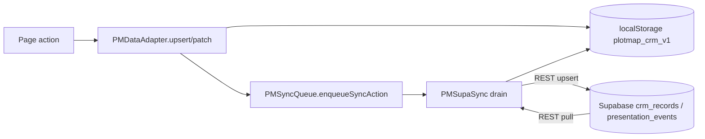

# 08 · Data Model and Adapters

Sources: `admin/core/data-adapter.js` (301), `admin/core/supabase-sync.js` (453),
`admin/core/sync-queue.js` (277), verification/migration SQL. `VERIFIED-CODE`/`VERIFIED-SQL`.
Reusable extract: `migration-kit/data-contracts/`.

## The two-layer model

PlotMap is **local-first**: the browser is the working store, Supabase is the durable
mirror. Writes go to `localStorage['plotmap_crm_v1']` immediately and are queued for
background push; pulls merge server rows back in.



## Local store shape (`PMDataAdapter`)

- `STORE_KEY = 'plotmap_crm_v1'`; `DEFAULT_DEALER_ID='dealer-demo'`; `DEFAULT_USER_ID='user-owner-demo'`.
- **Collections** (`COLLECTIONS`): `dealers, users, accessLinks, staff, areas, clients,
  properties, followups, siteVisits, deals, events, presentationEvents, reports, pins,
  mapDrawings, syncQueue, dealerSettings, shareLinks, auditLogs`.
- **Dealer-scoped collections** (`DEALER_SCOPED_COLLECTIONS`): everything except `dealers`.

### Public API (`window.PMDataAdapter`)
`getData()`, `getScopedData(input,dealerId)`, `saveData(data)`, `list(entity,{scoped,dealerId})`,
`findById(entity,id,opts)`, `upsert(entity,record,opts)`, `patch(entity,id,changes,opts)`,
`getCurrentDealer/Id`, `getCurrentUser`, `isDealerScopedEntity`, `belongsToDealer`,
`generateId`, `nowIso`, `ensureFoundationData`. `VERIFIED-CODE` `data-adapter.js:280-300`.

## Dealer scoping — the fail-closed rule (critical)

`upsert` stamps `dealerId` on scoped records using this precedence
(`data-adapter.js:222-232`):

```
item.dealerId
  ?? options.dealerId
  ?? getCurrentDealerId(data)
  ?? localStorage['plotmap_dealer_id']
  ?? (prodAdmin ? '__unresolved__' : DEFAULT_DEALER_ID)
```

**In production admin, an unresolved dealer becomes `'__unresolved__'`, not the demo
tenant.** `'__unresolved__'` fails closed — RLS rejects it server-side too. This prevents a
mis-scoped write silently landing in `dealer-demo`. **Preserve this exact fail-closed
behaviour in V2.** `VERIFIED-CODE` + code comment.

Dealer selection (`getDealerSelection`) may read `?dealerId`/`?dealer`/`?dealerSlug` for
**local selection only**; the authoritative tenant for writes is the auth-mirrored
`plotmap_dealer_id`. `data-adapter.js:71-95`.

## Supabase mirror tables (authoritative schema from SQL)

| Local collection(s) | Supabase table | Shape (key columns) |
|---|---|---|
| clients, properties, deals, followups, siteVisits, areas, pins, mapDrawings, … | **`crm_records`** | `id text, dealer_id text, entity_type text, payload jsonb, deleted bool, updated_at timestamptz` |
| presentationEvents | **`presentation_events`** | append-only usage events; anon INSERT-only via RLS |
| shareLinks | **`share_links`** | see `13` (client links extend this) |
| dealerSettings | **`dealer_settings`** | brand/logo/phone/whatsapp/photoBucket per dealer |
| auditLogs | **`audit_logs`** | `dealer_id, actor_profile_id, actor_role, action_type, entity_type, entity_id, metadata` |
| users/staff | **`profiles`** | `id, email, role, dealer_id, status, permissions, display_name` |
| — | `client_link_events`, `client_link_access_windows` | see `13` |
| — | provisioning attempt table | see `07` |

`crm_records` is a **single generic table keyed by `entity_type` + `payload` jsonb** — the
CRM's polymorphic backbone. `VERIFIED-SQL` `verify-private-client-links.sql:40-63`
(inserts `crm_records` with `entity_type` `clients`/`properties` and a jsonb payload);
`admin/core/supabase-sync.js:124` maps collections→tables.

## Sync engine (`PMSupaSync`)

- Table name mapping in `supabase-sync.js:124` (e.g. `presentationEvents→presentation_events`).
- `presentation_events` is **append-only for anon** — the sync path inserts, never upserts.
  `supabase-sync.js:235-238`. **Rule: never upsert `presentation_events`** (confirmed by the
  project memory note and code).
- Pull uses `created_at>` cursors persisted as pull stamps; dedupes by id. `supabase-sync.js:371-399`.
- Only runs on admin routes with `window.CRM` present. `supabase-sync.js:371`.

## Storage-key contract (data layer)
| Key | Meaning |
|---|---|
| `plotmap_crm_v1` | entire local CRM store |
| `plotmap_dealer_id` / `plotmap_user_id` / `plotmap_admin_role` | tenant/user/role mirror (from auth) |
| `plotmap_deal_followups_v1` | deal follow-ups (deals page) — `admin/deals.html:65` |

## Known weaknesses (fix or accept in V2)
1. **Implicit global coupling.** Adapter reads `plotmap_dealer_id` directly; no typed
   accessor. `INFERENCE`.
2. **Polymorphic `crm_records`.** Flexible but weakly typed; V2 could keep it (fast to port)
   or split into typed tables (better integrity). Trade-off documented in `22`.
3. **Local/server divergence risk.** Two stores need reconciliation; the queue + pull
   stamps mitigate but don't eliminate conflicts. `INFERENCE`.

## V2 decision
**ADAPT.** Keep the local-first pattern and the `crm_records`/`entity_type` contract to
de-risk the port, but wrap the adapter in a typed data-access layer with an explicit
`dealerId` dependency (no direct localStorage reads scattered across features), and keep
the `__unresolved__` fail-closed stamping and the append-only `presentation_events` rule.
