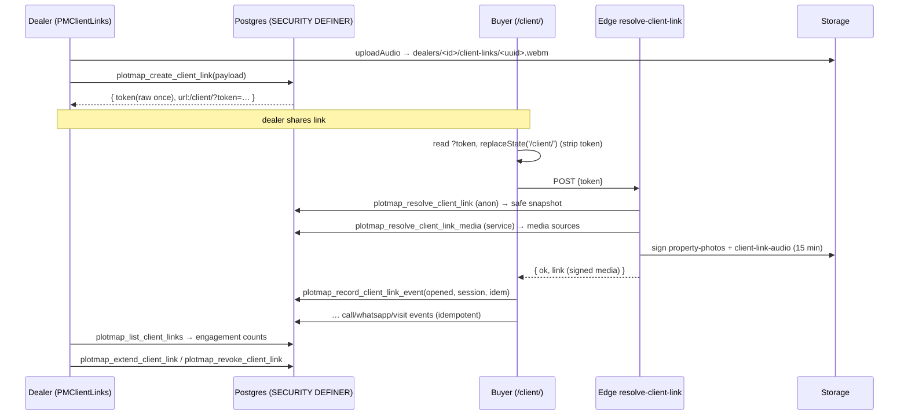

# 13 · Private Client Links (full internals)

The most security-sensitive feature. Sources (all `VERIFIED-CODE`/`VERIFIED-SQL`):
- Dealer client: `admin/core/plotmap-client-links.js` (180) → `PMClientLinks`
- Buyer page: `client/app.js` (102), `client/index.html`, `client/styles.css`
- Edge broker: `supabase/functions/resolve-client-link/index.ts` (115)
- Backend: `supabase/migrations/20260728000100_private_client_links.sql` (769) +
  `…000200_private_client_links_grant_hardening.sql` (14)
- Verification: `tools/verify-private-client-links.sql` (152)

Reusable extracts: `migration-kit/client-links/`, `migration-kit/supabase/migrations/`,
`migration-kit/edge-functions/resolve-client-link/`.

## Concept

A dealer selects **1–4 client-visible properties**, up to **8 photos each**, sets **price
and location visibility**, optionally records a **≤2-minute voice note**, and generates a
link `/client/?token=<64-hex>`. The server **freezes a client-safe snapshot** at creation
(never live inventory), returns the **raw token only once**, and stores only its
**SHA-256 hash**. The buyer opens the link with no login; an Edge Function resolves the
snapshot and mints **15-minute signed media URLs**. Opens/clicks are tracked idempotently.
Links **expire**, can be **extended** (3/7/14/30 days) or **revoked**, and everything is
**dealer-isolated**.

## Feature flag
`window.PM_CLIENT_LINKS_ENABLED = true` is set inline in `admin/properties.html:29`.
`PMClientLinks.isEnabled()` gates all dealer-side calls; when false they return a `PENDING`
"not enabled for this environment" object. `VERIFIED-CODE`.

## Dealer-side API (`window.PMClientLinks`)

| Method | RPC / endpoint | Validation (client) |
|---|---|---|
| `create(payload)` | `plotmap_create_client_link(p_payload)` | 1–4 propertyIds; priceVisibility∈{hidden,shown}; locationVisibility∈{area,exact,hidden}; expiresInDays∈{3,7,14,30} |
| `list(propertyId?)` | `plotmap_list_client_links(p_property_id)` | — |
| `revoke(id)` | `plotmap_revoke_client_link(p_link_id)` | — |
| `extend(id,days)` | `plotmap_extend_client_link(p_link_id,p_expires_in_days)` | days default 7 |
| `uploadAudio(blob,seconds)` | Storage `POST /object/client-link-audio/<path>` | ≤5 MB; mime∈{webm,mpeg,mp4,ogg,wav}; 1–120 s; `x-upsert:false` |
| `removeAudio(path)` | Storage `DELETE` | — |

`create` payload defaults (`withDefaults`): `priceVisibility='hidden'`,
`locationVisibility='area'`, `expiresInDays=7`, `propertyIds` sliced to 4. On success it
absolutizes the returned `url` against `location.origin`. Audio path format:
`dealers/<dealerId>/client-links/<randomUUID>.<ext>`. `VERIFIED-CODE`
`plotmap-client-links.js:31-42, 84-94, 123-156`.

Failure mapping (`safeFailure`): 401→`session_expired`, 403→`not_allowed`, 404→`PENDING`,
else `request_failed`. `VERIFIED-CODE`.

## Backend — `plotmap_create_client_link(p_payload jsonb)` (SECURITY DEFINER)

The heart of the client-safe guarantee. `VERIFIED-SQL` migration:155-398.

1. **Payload guard:** must be an object, ≤64 KB.
2. **Authz:** `auth.uid()` present, `plotmap_current_dealer_id()` present, and
   `plotmap_client_link_can_manage()` (edit-crm or edit-properties **and** dealer can write).
3. **Customer check:** if `clientId` given, it must be a non-deleted `crm_records` `clients`
   row for this dealer.
4. **Property selection:** 1–4 **unique** ids; each must be this dealer's non-deleted
   `properties` row with `clientVisible=true` and `internalStatus` **not** matching
   `archived|internal|hold|sold|hidden`.
5. **Visibility:** priceVisibility∈{hidden,shown}; locationVisibility∈{hidden,area,exact};
   expiry∈{3,7,14,30} days.
6. **Per-property snapshot:** assigns a random public id (`gen_random_bytes(12)`), copies
   **only client-safe fields** with length caps, and applies visibility:
   - `area` only when location ∈ {area,exact}; `sector`+`plotNumber` only when `exact`.
   - `price` only when priceVisibility='shown'.
   - **`sellerName`/`sellerPhone`/`commission`/`negotiationNotes` are never copied.**
7. **Photos:** each ref must match `^(external|storage):[0-7]$`.
   - `external:i` → `payload.photos[i]`, must be `^https://` and ≤2048 chars.
   - `storage:i` → `payload.photoStorage[i]` with `kind='storage'`; the path must pass
     `plotmap_photo_dealer_id`=dealer, `plotmap_photo_property_id`=this property, and
     `plotmap_property_photo_path_is_valid`. Max 8 photos/property, ≥1 required.
   - The snapshot stores a **public photo id** + kind (+ external url); the **real source**
     (storage path or url) is stored separately under `metadata.client_media[photoPublicId]`
     — never exposed to the public snapshot RPC.
8. **Audio:** if `audio.objectPath` given, 1–120 s, path valid, and the object must exist in
   `client-link-audio`.
9. **Token:** raw = `gen_random_bytes(32)` hex (64 chars); stored **hash** =
   `digest(raw,'sha256')` hex; `token_hint` = last 4 chars.
10. **Insert** into `share_links` with `target_type='client_link'`, `url='/client/'`,
    `status='active'`, `expires_at`, `metadata={client_snapshot, client_media,
    audio_object_path, audio_seconds}`, `snapshot_version=1`.
11. **Audit** row in `audit_logs` (`client_link_created`).
12. **Return** `{ ok, id, token(raw), slug(raw), url:'/client/?token='+raw, expiresAt }` —
    the **only** time the raw token exists.

## Backend — resolve / media / events

| RPC | Grant | Returns | Notes |
|---|---|---|---|
| `plotmap_resolve_client_link(p_token)` | **anon**, authenticated | `{ok, link:snapshot+expiresAt+hashed linkId}` or `{ok:false, reason}` | validates `^[0-9a-f]{64}$`, hashes, rate-limits (advisory-lock + 15-min window, cap 120), checks revoked/expired/dealer-active. **Returns snapshot only — no media sources.** |
| `plotmap_resolve_client_link_media(p_token)` | **service_role only** | `{media, audioObjectPath, audioSeconds}` or null | `auth.role()<>'service_role'` → null. Used only by the Edge broker to sign media. |
| `plotmap_record_client_link_event(p_token,type,session_id,idempotency_key,metadata)` | **anon**, authenticated | `{ok, duplicate}` | type∈{opened,audio_played,call_clicked,whatsapp_clicked,visit_requested}; session/idempotency 16–128 chars; metadata ≤2 KB and **rejected if it matches secret-shaped patterns**; per-session 60/hour cap; idempotent on `(link_id, idempotency_hash)`; `opened` updates `opened_at/last_opened_at`. |
| `plotmap_list_client_links(p_property_id?)` | authenticated | JSON array w/ status, counts, tokenHint, hasAudio, event tallies | dealer-scoped; computes `revoked`/`expired` display status. |
| `plotmap_revoke_client_link(p_link_id)` | authenticated | `{ok}` | sets status revoked; audit. |
| `plotmap_extend_client_link(p_link_id,days)` | authenticated | `{ok, expiresAt}` | days∈{3,7,14,30}; audit. |

All are `SECURITY DEFINER`, all `revoke all from public,anon,authenticated` then grant
narrowly. `VERIFIED-SQL` migration:688-709.

## Edge broker (`resolve-client-link`) — see `16` for full detail
The buyer page calls the Edge Function first; it calls `plotmap_resolve_client_link` (anon
key) for the safe snapshot, then `plotmap_resolve_client_link_media` (**service key**, in the
Edge runtime only) for media sources, signs storage photos + audio for **15 minutes**
(`property-photos` / `client-link-audio`), replaces external urls verbatim (https only),
drops any photo without an https url, and returns `{ok, link}`. Strict CORS allowlist,
`default-src 'none'` CSP, no-store. `VERIFIED-CODE` `resolve-client-link/index.ts`.

## Buyer page (`client/app.js`)
- Reads `?token`, generates a session id, then **`history.replaceState(null,'','/client/')`
  to strip the token from history** immediately. `VERIFIED-CODE` `client/app.js:6-8`.
- `resolveLink()` tries the Edge Function; on 404/503 falls back to the anon RPC (snapshot
  only, no signed media). Validates token is 64-hex before any call.
- Renders brand header, per-property cards (photos filtered to https), optional audio
  element, and CTA buttons (`call`/`whatsapp`/`visit`) with `data-event` attributes.
- Fires `opened` on render, `audio_played` once on first play, and the CTA events on click
  (idempotency key per event). `VERIFIED-CODE` `client/app.js:48-96`.

## End-to-end flow (Mermaid)

## Isolation & safety proof
`tools/verify-private-client-links.sql` (rollback-wrapped) asserts, among others: token is
256-bit hex and **never stored in plaintext**; resolver never leaks
`sellerName/sellerPhone/commission/negotiationNotes/Secret Sector/SECRET-42/12345678`;
area-only vs exact behaviour; hidden price stays hidden; anon receives **no** media; events
are idempotent; invalid token rejected; **dealer B cannot list/revoke/extend dealer A's
link**; expired→`expired`, revoked→`revoked`; delete cascades events; **no direct anon/auth
table grants**; audio bucket is **not public**. This file IS the V2 acceptance test — port
it (`24`). `VERIFIED-SQL`.

## V2 decision
**REUSE (backend, port near-verbatim) + REWRITE (buyer UI in V2 system).** The SQL RPCs,
grants, storage policies, the Edge broker, and the verification script are the crown jewels —
port them with env re-wire only. Rebuild `client/*` visuals in the V2 design system while
preserving: token-strip-from-history, Edge-first-then-RPC-fallback, https-only media, and
the exact event contract.
