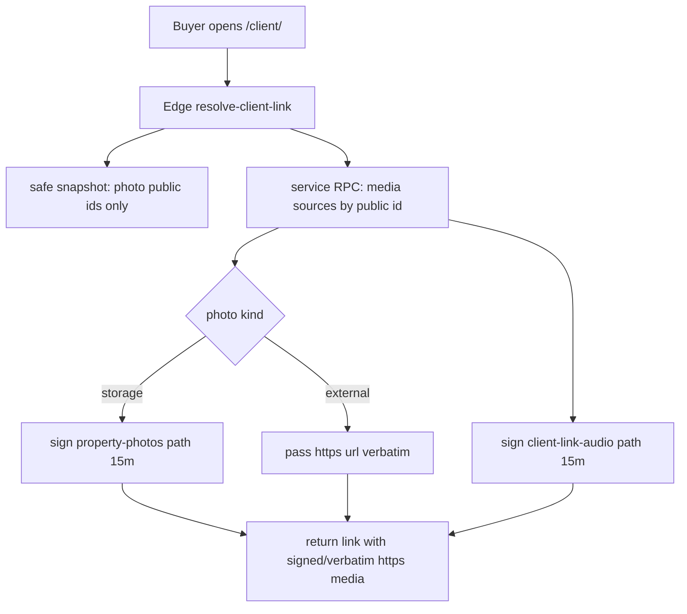

# 14 · Storage and Signed Media

Sources: `supabase/migrations/20260707_storage_photo_policies_draft.sql`,
`20260708_phase5_property_photo_storage_policies.sql`,
`20260728000100_private_client_links.sql` (buckets/policies),
`admin/core/plotmap-client-links.js`, `supabase/functions/resolve-client-link/index.ts`,
`supabase/functions/delete-dealer/index.ts`. `VERIFIED-SQL`/`VERIFIED-CODE`.
Manifest: `manifests/buckets.json`.

## Buckets

| Bucket | Public | Limits | Purpose |
|---|---|---|---|
| `property-photos` | **false** | (see phase5 migration) | dealer property photos |
| `client-link-audio` | **false** | 5 MB; mime `audio/{webm,mpeg,mp4,ogg,wav}` | frozen client-link voice notes |

Both are **private**. The verification script explicitly asserts `client-link-audio` is not
public. `VERIFIED-SQL` link migration:713-724, verify:146-148.

## Path formats (dealer-scoped, RLS-enforced)

| Bucket | Path | Validator |
|---|---|---|
| `property-photos` | `dealers/<dealerId>/...` | `plotmap_property_photo_path_is_valid`, `plotmap_photo_dealer_id`, `plotmap_photo_property_id` |
| `client-link-audio` | `dealers/<dealerId>/client-links/<uuid>.<ext>` | `plotmap_client_link_audio_path_is_valid` |

`plotmap_client_link_audio_path_is_valid(p_path)` requires foldername[1]=`dealers`,
[2]=`plotmap_current_dealer_id()`, [3]=`client-links`, [4] null, a non-empty filename, and
extension ∈ {webm,mp3,mp4,ogg,wav}. `VERIFIED-SQL` link migration:94-107.

## Storage RLS policies (client-link-audio)
- **member read:** authenticated + `plotmap_is_active_member()` + path valid.
- **insert/update/delete:** authenticated + `plotmap_client_link_can_manage()` + path valid.
- **No anonymous read policy exists** — the public buyer never reads the bucket directly.
`VERIFIED-SQL` link migration:726-766.

## Signed media delivery (the only public read path)

Public buyers **never** get bucket access. Instead the `resolve-client-link` Edge Function
(service role, inside Deno runtime) mints **15-minute** signed URLs:

- `SIGNED_URL_SECONDS = 15*60`. `sign(bucket,path)` rejects paths containing `..` or leading
  `/`, calls `POST /storage/v1/object/sign/<bucket>/<encoded path>`, and returns an absolute
  signed URL only if it starts with `/`. `VERIFIED-CODE` `resolve-client-link/index.ts:15,47-62`.
- Storage photos → signed `property-photos` url; external photos → the https url verbatim;
  audio → signed `client-link-audio` url. Any photo without a resulting https url is
  **dropped** from the response. `resolve-client-link/index.ts:96-112`.

## Audio upload (dealer side)
`PMClientLinks.uploadAudio(blob,seconds)`: validates ≤5 MB + mime + 1–120 s, resolves
`dealer_id` from the profile (`^[a-zA-Z0-9._-]{1,120}$`), builds the path, and `POST`s with
`x-upsert:false` (no overwrite). Returns `{ok, objectPath, seconds}`; `removeAudio(path)`
DELETEs. `VERIFIED-CODE` `plotmap-client-links.js:123-166`.

## Cleanup on dealer deletion
`delete-dealer` enumerates and deletes `dealers/<dealerId>` objects in **both** buckets
(`DEALER_STORAGE_BUCKETS=['property-photos','client-link-audio']`) via the Storage API
(SQL cannot delete `storage.objects` directly). See `18`. `VERIFIED-CODE`.

## V2 decision
**REUSE.** Recreate both private buckets, the path validators, and the storage RLS in the
new project; port the signed-media broker as-is. Never make either bucket public; never
serve media to buyers except through short-lived signed URLs minted by the service-role
Edge broker.
