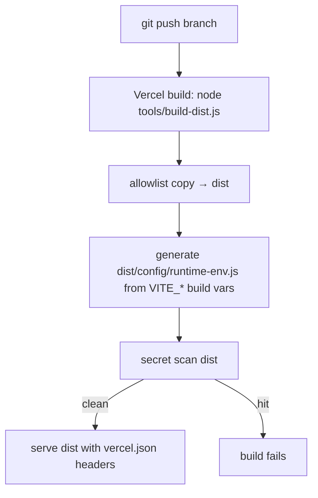

# 17 · Build, Runtime, and Deployment

Sources: `tools/build-dist.js` (149), `tools/generate-runtime-env.js`, `vercel.json`,
`.vercelignore`, `config/supabase-config.js`, `config/runtime-env.js` (generated).
`VERIFIED-CODE`. Vercel project name `property-software` is `REPORT-CLAIM`.

## Build pipeline (`node tools/build-dist.js`)

1. **Clean `dist/`** (refuses to delete a dist outside the repo root).
2. **Allowlist copy** — only these top-level entries are copied:
   `index.html, app, admin, client, config, maps, normal maps, public`. Required entries
   (`index.html, app, admin, client, config`) missing → build **fails**.
3. **Exclude patterns** (never enter dist even under an included root): `.git`,
   `node_modules`, `.env*`, `dist`, `*.sql`, `*.md`, dev-only image intermediates, and any
   committed `config/runtime-env.js` (it is generated fresh).
4. **Generate `dist/config/runtime-env.js`** via `tools/generate-runtime-env.js` from the two
   public build vars (`VITE_SUPABASE_URL`, `VITE_SUPABASE_ANON_KEY`). Exactly one present →
   build fails; both absent → fallback `{}` mode; secret-shaped values rejected.
5. **Secret scan** of the finished dist — patterns: `sb_secret_…`, service-role marker,
   service-role JWT (base64 `service_role`), postgres connection string, private-key block,
   and any `.env*` file present. Any hit → build **fails**.

**Guarantee:** `dist/` never contains `.env`, secrets, SQL, docs, tools, or dev
intermediates, and always has exactly one `runtime-env.js`. `VERIFIED-CODE` `build-dist.js:11-19`.

## Runtime config resolution
See `02`. `config/supabase-config.js` accepts the runtime pair only if URL is
`https://*.supabase.co` and key is public (rejects service-role); else uses the frozen public
fallback (project `czmkfmkmgqlienmdihul`). `runtime-env.js` sets `window.env`. `VERIFIED-CODE`.

## Vercel configuration (`vercel.json`)
- `buildCommand: node tools/build-dist.js`, `outputDirectory: dist`.
- Headers:
  - `/config/runtime-env.js` → `no-store` (never cache config).
  - `/client/(.*)` → `no-store`, `Referrer-Policy: no-referrer`,
    `X-Robots-Tag: noindex,nofollow,noarchive`, and a strict **CSP**:
    `default-src 'self'; connect-src 'self' https://*.supabase.co; img-src 'self' https: data:;
    media-src https:; style-src 'self'; script-src 'self'; frame-ancestors 'none';
    base-uri 'none'; form-action 'none'`.
  - `/maps/`, `/normal maps/`, `/public/plotmap-assets/` → 1-day cache + SWR.
- `.vercelignore` excludes `dist, docs, supabase, _design, archive, .agents, node_modules`,
  `.env*`, `*.local`, and dev image intermediates. **`tools/` MUST be uploaded** (the build
  runs it) — a prior ignore of `tools/` caused a `runtime-env.js` 404 (see `19`).

## Deployment flow (Mermaid)

## Verification tooling (run before trusting a deploy)
- `node tools/build-dist.js` — build + secret scan.
- `git diff --check` — whitespace/conflict-marker check.
- `node tools/verify-isolation.js` — dealer isolation probes.
- `tools/verify-private-client-links.sql` — client-link security (rollback-wrapped).
- Other `tools/verify-*.js` — provisioning, dealer360, onboarding-deletion (staging).

## Known deployment pitfalls (see `19`)
Wrong Vercel project linking; unauthenticated Supabase CLI; `tools/` ignored → runtime-env
404; production/staging confusion. `HISTORICAL`/`REPORT-CLAIM`.

## V2 decision
**ADAPT.** Keep the allowlist-copy + generate-runtime-env + secret-scan discipline and the
security headers/CSP verbatim (they are excellent). If V2 adopts a bundler, fold these
guarantees into the build (allowlist output, scan artifacts, no service-role key client-side,
no-store on config, strict `/client/` CSP). Re-point env to the new project.
