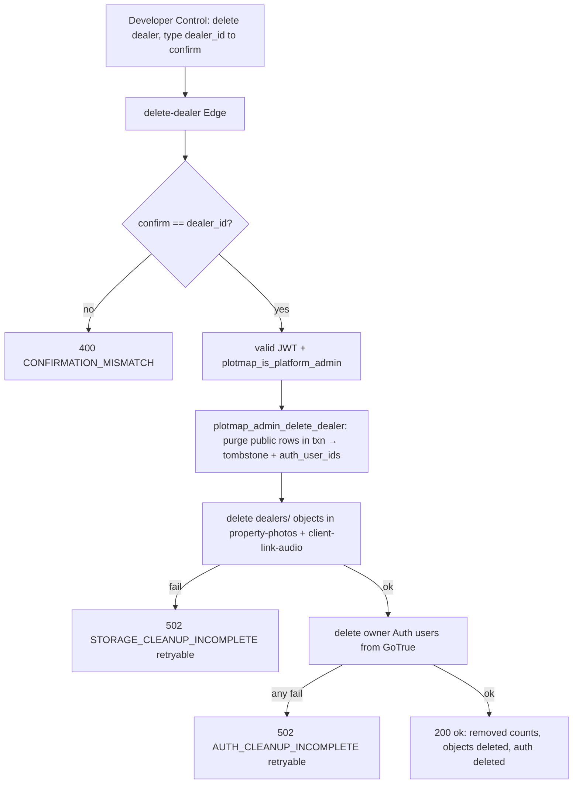

# 18 · Dealer Deletion and Cleanup

Source: `supabase/functions/delete-dealer/index.ts` (258) +
`supabase/migrations/20260724000100_onboarding_access_and_dealer_deletion.sql`
(`plotmap_admin_delete_dealer`). `VERIFIED-CODE`/`VERIFIED-SQL`. This is a **destructive,
irreversible** platform-admin operation — the inverse of provisioning (`07`).

## Guarantees
1. **Confirmation-guarded:** the request must include `confirm` exactly equal to
   `dealer_id`; otherwise 400 `CONFIRMATION_MISMATCH`. `delete-dealer/index.ts:162-164`.
2. **Platform-admin only:** valid JWT + `plotmap_is_platform_admin`. `:166-168`.
3. **Transactional public-row purge:** `plotmap_admin_delete_dealer(p_dealer_id, p_confirm)`
   purges all public-schema rows in one transaction and returns a summary incl.
   `auth_user_ids` and an `operation_id` (a durable **tombstone** enabling safe retry).
4. **Storage cleanup via Storage API:** SQL cannot delete `storage.objects`, so the function
   enumerates `dealers/<dealerId>` in **both** buckets (`property-photos`, `client-link-audio`),
   paginating (limit 100, ≤10 000 objects) and batch-deleting (100 at a time). `:83-140`.
5. **Auth cleanup:** deletes each returned owner Auth user id (uuid-validated) from GoTrue;
   404/`user_not_found` counts as deleted. `:204-230`.
6. **Idempotent / retryable:** a repeat call reuses the tombstone's `auth_user_ids`; storage
   or auth cleanup failure returns **502 with `retryable:true`** so the UI can never report
   full success while a login or object still exists. `:188-245`.

## Deletion flow (Mermaid)

## Success payload
`{ ok, dealer_id, already_deleted, operation_id, removed:{…}, property_photo_objects_deleted,
client_link_audio_objects_deleted, auth_users_deleted, auth_users_pending:0 }`.

## Cascade note
Client-link events cascade automatically: `client_link_events.link_id` and
`client_link_access_windows.link_id` are `on delete cascade` to `share_links`, so purging a
dealer's `share_links` removes their events/windows. Verified by
`verify-private-client-links.sql:136-138` (delete cascades events). `VERIFIED-SQL`.

## Rollout dependency
Header states: apply `20260724000100_…` **first**, then deploy `delete-dealer`. Until both
are live, the UI action degrades to "not enabled on this server yet." `VERIFIED-CODE`.

## V2 decision
**REUSE.** Port the RPC + Edge function verbatim (env re-wire). Keep confirmation-guard,
tombstone-based idempotency, both-bucket storage sweep, GoTrue cleanup, and the retryable
partial-failure contract. Never expose this outside the service-role Edge boundary.
