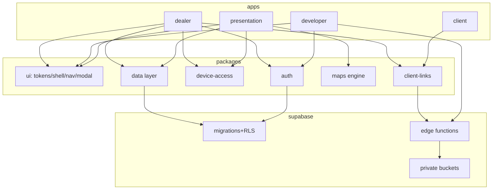

# 22 · V2 Architecture (recommended)

Goal: eliminate the root cause of V1's fragility — **implicit global ordering, duplicated
shells/nav, mixed design eras, and frontend/security entanglement** — while **reusing the
proven backend, security, maps, and client-link systems verbatim.**

## Repository strategy
A **new clean repository**, a **new Vercel project**, and a **separate Supabase project**
(dev first, then prod). The V1 repo stays as the functional reference only through *this
blueprint* — V2 agents must **not** reopen it. `APPROVED-PRODUCT` (report) + `INFERENCE`.

## Technology recommendation
PlotMap's real needs: multi-page product surfaces, a heavy imperative map/canvas engine, a
tiny public buyer page, strict CSP, static hosting, and a small team. **Recommendation:**

- **Keep it framework-light but make the module graph explicit.** Use a small build tool
  (Vite) with **TypeScript** and ES modules — no positional `<script>` ordering. This gives
  typed contracts (the #1 missing safety in V1) while keeping the app close to the proven
  vanilla engine so the map port is low-risk.
- A component framework (React/Svelte) is **optional** for the dealer app only; the **map
  engine and buyer page should stay framework-free** to preserve the ported pixel math and
  the minimal buyer bundle. If a framework is adopted, isolate the map engine behind a plain
  DOM boundary.
- **Do not pick a technology just because V1 used it, nor just because it's fashionable.**
  Optimize for: map-port safety, strict CSP, and typed data/security contracts.

Trade-off table:

| Option | Pro | Con | Verdict |
|---|---|---|---|
| Continue plain vanilla, no build | zero build of app code | keeps implicit-ordering fragility | ✗ |
| **Vite + TS + ES modules, framework-light** | explicit graph, types, keep engine | small build step | ✅ recommended |
| Full SPA framework everywhere | rich UI | risky map port, heavier buyer page | ✗ (partial only) |

## Folder structure

```
plotmap-v2/
├── apps/
│   ├── dealer/          # /admin equivalent: shell + CRM routes
│   ├── developer/       # Developer Control
│   ├── presentation/    # /app/plotmap client presentation (wraps maps engine)
│   └── client/          # /client buyer page (minimal, framework-free)
├── packages/
│   ├── ui/              # ONE design system: tokens + components + shell + nav + modal/drawer
│   ├── auth/            # PMAuth port: session, profile, dealerId accessor, platform-admin check
│   ├── device-access/   # approved-device gate (opaque token + server hash)
│   ├── data/            # typed data layer over crm_records + local-first store + sync
│   ├── maps/            # ported registry + datasets + overlay engine (stable API)
│   └── client-links/    # PMClientLinks port + buyer render contract
├── supabase/
│   ├── migrations/      # ported enforced migrations (in order)
│   ├── functions/       # resolve-client-link, provision-dealer, delete-dealer
│   └── verification/    # verify-isolation, verify-private-client-links, +unit SQL
├── public/maps/         # self-hosted map assets (no CDN)
└── docs/                # PRODUCT/DATABASE/ROUTE/SECURITY/DESIGN contracts (from this blueprint)
```

## Mandatory "one of each" rules (V2 acceptance)
One design-token source · one component library · one app-shell · one navigation definition
· one modal/drawer system · one data-access layer · one auth/session layer · one responsive
system. No page-specific shell/nav. No second design system. `APPROVED-PRODUCT`.

## Separation of concerns
- **Design layer** (packages/ui + apps/*) is built and QA'd **independently** of backend.
- **Backend/security** (supabase/*) is ported **behind a stable data/auth API** so the UI
  never re-implements a security decision.
- **Maps** are a self-contained package with a stable API; the presentation app only consumes it.

## Complete application architecture (Mermaid)


## What V2 must preserve (hard constraints)
All of `20_SECURITY_INVARIANTS.md`, the map registry/engine contracts (`11`), the data
contracts (`08`), the client-link flow (`13`), and the build/deploy discipline (`17`).
