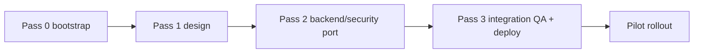

# 23 · V2 Build Sequence

A three-pass sequence: **design → backend/security port → QA/deploy.** Each pass is a
discrete, verifiable milestone. Do not interleave frontend redesign with security porting
(a named V1 failure mode). `APPROVED-PRODUCT` + `INFERENCE`.

## Pass 0 — Bootstrap (once)
1. Create new repo, Vite + TS scaffold, `packages/` + `apps/` skeleton (`22`).
2. Create new Supabase **dev** project; capture its URL + publishable key.
3. Create new Vercel project; wire `VITE_SUPABASE_URL` / `VITE_SUPABASE_ANON_KEY` build vars.
4. Copy `migration-kit/` into place; do **not** run it yet.

## Pass 1 — Full design implementation (Antigravity)
Build **every approved screen in one coherent pass** on one design system, one shell, one
nav, one modal/drawer, one data-adapter boundary (mocked). Deliver:
- `packages/ui` (tokens, components, shell, nav, modal/drawer, responsive).
- `apps/dealer` routes: Home, My Plots, My Deals, My Customers, Demand, Team Workspace,
  Area Intelligence, Property Insights, Map Studio (chrome).
- `apps/developer`, `apps/presentation` chrome, `apps/client` buyer page.
- All loading / empty / error / modal / drawer / responsive states.
- Strict data-adapter boundary so real backend attaches later without UI redesign.
**Gate:** visual parity vs approved designs at 1440×900, 1366×768, 1024×768, 430×932, 390×844;
no horizontal overflow; no console errors.

## Pass 2 — Backend & security port (Codex)
Port from `migration-kit/`, in this order:
1. Supabase migrations (**enforced set, in order**) → dev project; run `verify-isolation` +
   `verify-private-client-links.sql`.
2. Storage buckets + policies (private); verify not-public + path validators.
3. `auth` + `device-access` packages behind stable APIs.
4. `data` layer over `crm_records` (+ `__unresolved__` fail-closed, append-only events).
5. `client-links` package + `resolve-client-link` Edge function; sign media; buyer wiring.
6. `provision-dealer` + `delete-dealer` Edge functions; Developer Control wiring.
7. Maps package (registry generator + assets + overlay engine) with stable API.
**Gate:** every security invariant in `20` holds; all `verify-*` pass on the dev project.

## Pass 3 — Integration QA & deploy (Antigravity)
1. Wire real data/auth into the Pass-1 UI (remove mocks).
2. Browser QA: onboarding (create dealer → activation code → login → device approve →
   revoke → reactivate); client links (create → audio → open on phone → CTA tracking →
   extend → revoke → revoked stops opening); maps (Original/Easy, zoom, Fit Map, no
   crop/distortion, photo rail); security exposure (no seller/commission/notes leak).
2. Health: no console errors, no failed required requests, no overflow, fonts load, routes
   preserved.
3. Deploy **preview first**, verify, then production; run `build-dist` discipline
   (allowlist + secret scan), `git diff --check`, confirm no secrets in source/dist.
**Gate:** all acceptance tests in `24` green on preview, then production verified.

## Sequence (Mermaid)

## Definition of done (per pass)
- Pass 1: navigable design system, all states, viewport parity, no overflow.
- Pass 2: all `verify-*` green, invariants `20` hold, no service-role key client-side.
- Pass 3: acceptance tests `24` green on preview + prod; onboarding + client-link + map flows
  proven in-browser; deployment evidence captured.
